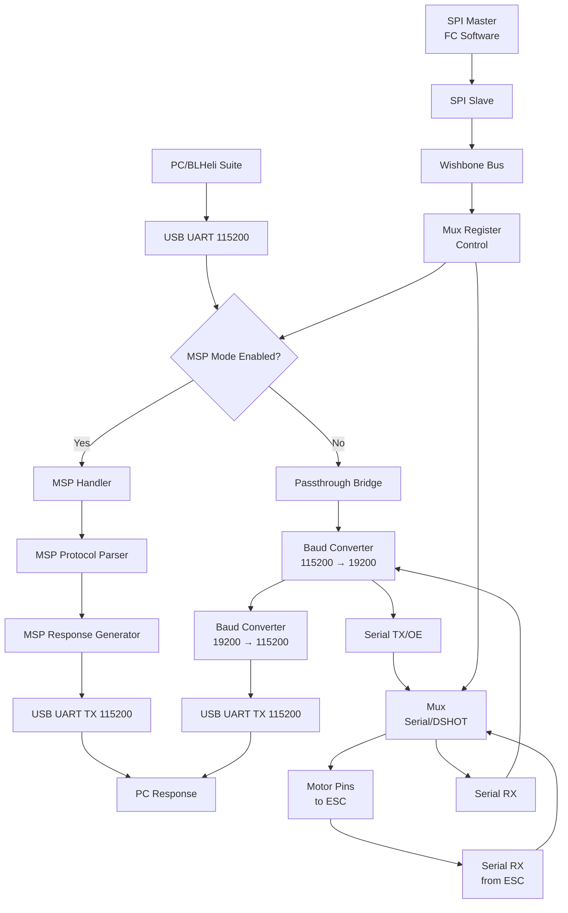

# SPIQuadCopter Data Flow Architecture

## Architecture Overview

The SPIQuadCopter FPGA has two mutually exclusive operating modes controlled by SPI register:

### MSP FC Protocol Mode (msp_mode = 1)
- Direct USB UART communication with PC
- MSP Handler parses FC commands and generates responses
- Bypasses motor pins and passthrough bridge
- Used for FC protocol testing and configuration

### BLHeli Passthrough Mode (msp_mode = 0)
- USB UART ↔ Serial baud conversion for ESC communication
- Routes through motor pins via mux
- Traditional BLHeli ESC configuration mode

### Control
- Mode selection via SPI register bit 3 (`msp_mode`)
- Motor channel selection via SPI register bits 2:1 (`mux_ch`)
- Serial/DSHOT selection via SPI register bit 0 (`mux_sel`)