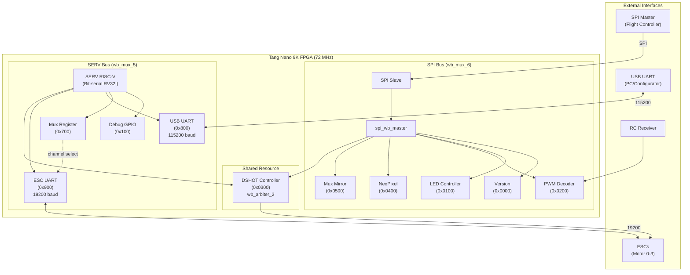

# System Block Diagram (Mermaid)

This file contains a Mermaid diagram for the SPIQuadCopter system. You can preview this in VS Code (Mermaid extension) or on GitHub (if Mermaid is enabled).

## Architecture Notes

### Dual Wishbone Bus
- **SPI Bus**: Flight controller access to peripherals
- **SERV Bus**: CPU handles protocol processing

### Shared DSHOT
- `wb_arbiter_2` allows both buses to access DSHOT controller
- Priority: Round-robin arbitration

### ESC Configuration Flow
1. PC connects via USB UART (115200 baud)
2. SERV firmware detects MSP/4-Way protocol
3. Mux register selects ESC channel (0-3)
4. SERV bridges USB ↔ ESC UART (19200 baud)

