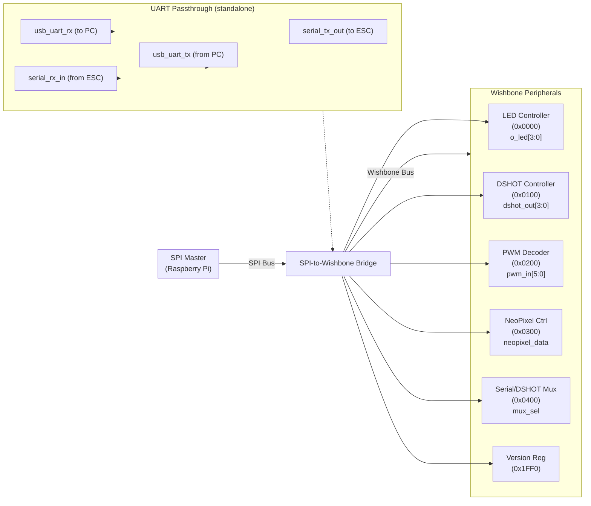

# System Block Diagram (Mermaid)

This file contains a Mermaid diagram for the SPIQuadCopter system. You can preview this in VS Code (Mermaid extension) or on GitHub (if Mermaid is enabled).

```mermaid
flowchart LR
  subgraph SPI_MASTER["SPI Master\n(Raspberry Pi)"]
  end

  SPI_MASTER -->|SPI Bus| SPI_BRIDGE["SPI-to-Wishbone Bridge"]

  SPI_BRIDGE -->|Wishbone Bus| WB

  subgraph WB["Wishbone Peripherals"]
    direction TB
    LED["LED Controller\n(0x0000)\no_led[3:0]"]
    DSHOT["DSHOT Controller\n(0x0100)\ndshot_out[3:0]"]
    PWM["PWM Decoder\n(0x0200)\npwm_in[5:0]"]
    NEOPX["NeoPixel Ctrl\n(0x0300)\nneopixel_data"]
    MUX["Serial/DSHOT Mux\n(0x0400)\nmux_sel"]
    VER["Version Reg\n(0x1FF0)"]
  end

  SPI_BRIDGE --> LED
  SPI_BRIDGE --> DSHOT
  SPI_BRIDGE --> PWM
  SPI_BRIDGE --> NEOPX
  SPI_BRIDGE --> MUX
  SPI_BRIDGE --> VER

  subgraph PASSTHROUGH["UART Passthrough (standalone)"]
    direction LR
    USB_RX["usb_uart_rx (to PC)"]
    USB_TX["usb_uart_tx (from PC)"]
    SER_TX["serial_tx_out (to ESC)"]
    SER_RX["serial_rx_in (from ESC)"]
  end

  PASSTHROUGH -.-> SPI_BRIDGE
  USB_RX --> PASSTHROUGH
  PASSTHROUGH --> USB_TX
  PASSTHROUGH --> SER_TX
  SER_RX --> PASSTHROUGH
```
